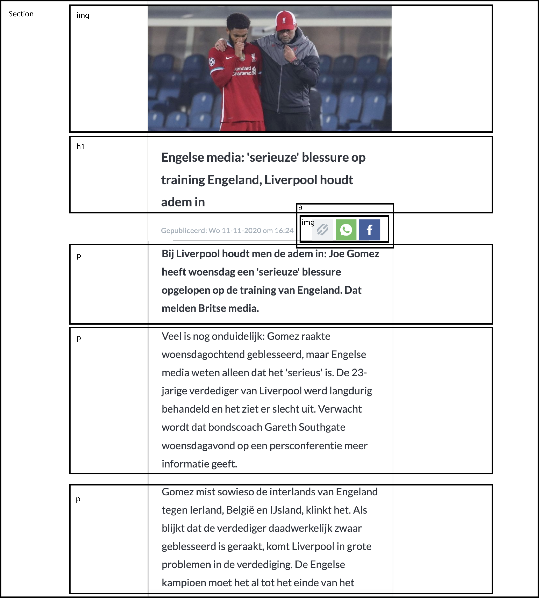
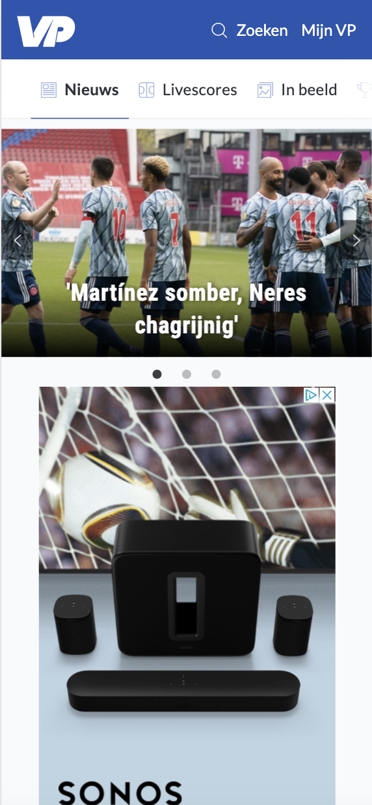
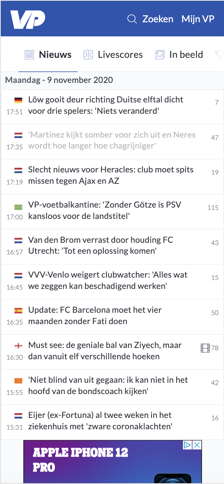
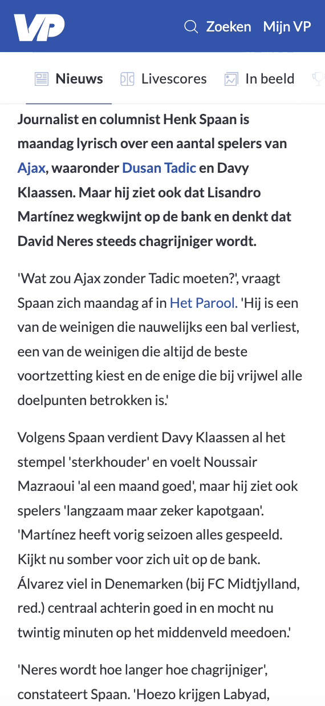

# Procesverslag
**Auteur:** -Wessel Glansbeek-

Markdown cheat cheet: [Hulp bij het schrijven van Markdown](https://github.com/adam-p/markdown-here/wiki/Markdown-Cheatsheet). Nb. de standaardstructuur en de spartaanse opmaak zijn helemaal prima. Het gaat om de inhoud van je procesverslag. Besteedt de tijd voor pracht en praal aan je website.

## Bronnenlijst
1. Aangezien ik achter liep en dit vak graag wilde halen heb ik ruim 10 lesuren genomen bij Dar Sissau van super-prof.nl. Wij hebben samen de opdracht, toegankelijkheidstests en beoordelingsformulier doorgenomen en ik heb met zijn hulp de code geschreven.
2. -bron 2-
3. -...-

Verslag toegankelijkheidstesten:

Dar en ik hebben de WCAG test doorlopen en alles zoveel mogelijk aangepakt. Mijn website was al in een vergevorderd stadium, maar we kwamen erachter dat nog niet elke img en artikelen bereikbaar is met de tab. Bij de originele website was dit helemaal niet het geval. Op mijn website is het dus in ieder geval al beter. Tevens was het hamburger menuutje nog niet te bereiken. En in de inhoud wat hier instaat. Dit hebben we opgelost en aangepakt. Verder heb ik alle html code in de w3 validator gedaan en de foutmeldingen verholpen. Als het goed is, zijn er nu geen foutmeldingen meer. Qua kleurcontrast zat het best goed bij de website van voetbalprimeur. Ik heb de website echter zo goed mogelijk proberen na te maken. Over het carousel zit nu een zwart vlak met opacity zodat het nog beter leesbaar is. De screenreader test ben ik helaas niet aan toegekomen wegens tijdgebrek. 

## Eindgesprek (week 7/8)

Wat goed ging is dat ik van Dar best veel geleerd heb. Ik heb veel geleerd hoe inspector toe te passen en hoe dit van waarde kan zijn tijdens het programmeren. Verder denk ik stappen gemaakt te hebben in het positioneren. FlexFroggy en GridGarden veel gespeeld. Ik ben ook tevreden over het eindresultaat. De website lijkt aardig op het origineel. Waar ik minder tevreden over ben is het proces. Wegens prive omstandigheden heb ik de lessen niet kunnen volgen, dus ook geen voortgang kunnen bespreken etc. Dit had ik uiteraard wel gewild. Aangezien ik nogal moeite had met coderen staan er naar mijn mening nog teveel classes in. Soms noodzakelijk, soms vond ik het later te lastig ze om te zetten naar selectoren. Een aantal heb ik wel al omgezet.

**Screenshot(s):**

-screenshot(s) van je eindresultaat-

## Voortgang 3 (week 6)

-same as voortgang 1-

## Voortgang 2 (week 5)

-same as voortgang 1-

## Voortgang 1 (week 3)

### Stand van zaken

-Ik vind het lastig te coderen met een blanco scherm voor me. Wanneer ik meekijk als iemand anders codeert snap ik het altijd wel-

**Screenshot(s):**

-header en nav beginnetje gemaakt-

### Agenda voor meeting

### Verslag van meeting

-na afloop snel uitkomsten vastleggen-

## Breakdownschets (week 1)

-uitwerken voor de 1e werkgroep - eind van de eerste week-

## Intake (week 1)
-uitwerken voor de kick-off werkgroep - begin van de eerste week-

**Je startniveau:** -blauw-

**Je focus:** -responsive-

**Je opdracht:** -voetbalprimeur.nl-

**Screenshot(s) van de eerste pagina (small screen):**

**Screenshot(s) van de tweede pagina (small screen):**

